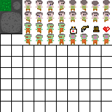
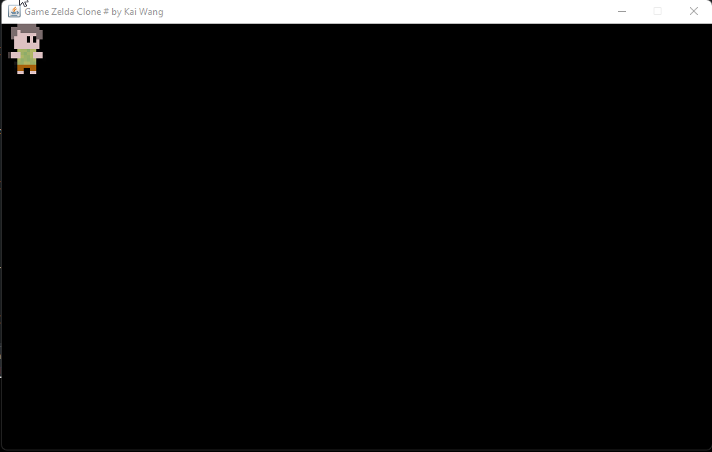
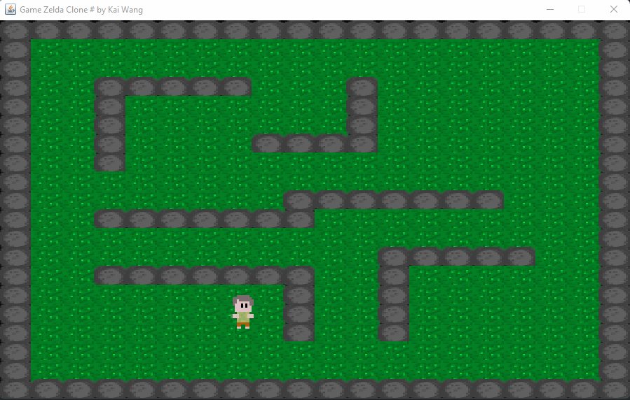

# GAME CLONE ZELDA - DANKI CODE

### Idéias proposta na aula

- [x] Artes para o jogo /SPRITES
- [ ] Sistema de Pause Game, Game Over e Menu
- [x] Sistema para animação do game
- [x] Controlar o player pelo teclado
- [ ] Sistema para SHOOTING
- [x ] Sistema para geração de MAPA
- [ ] Sistema com Leveis
- [ ] Inimigos do Game
- [ ] Batalha contra BOSS
- [ ] Coletar Itens
- [ ] Aumentar ATK ou DEF confome itens
- [ ] Sistema para Danos
- [ ] Sistema para salvar o Jogo e Para carregar o Game.
- [ ] Audio e música [final]

#### Arte para o jogos : 

planilha de SPRITES arts

Padrão para o map do grame

### Sistema de Animação para o player :

O sistema de movimento do game utiliza a interface KeyListener do java, onde é verificado 
qual tecla o usuário está apertando, desta forma será informado ao methodo da class 
player a direção e realizado o movimento, o player anima ao se mover da esqueda para 
direita e de cima para baixo

### Sistema para criação do mapa

Na aula prática foi aprendido sistema para gerar o mapa do game, atravez de um Sprite mapeado 
com regiões por cores, onde o sistema identifica cada cor e substitui pelos Tiles necessários 
para gerar a cena.

### Sistema para Camera acompanhar o mapa.

Usando a linguagem de programação java, foi usado metodo para que o player sempre fique 
no centro da tela e a váriavel da camera que é porcentual da tela de game sempre seja 
desconsiderada dos objetos renderizados e assim possa ocasionar o efeito de movimento 
entre o cenário.

