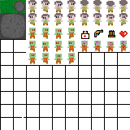
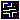

# GAME CLONE ZELDA - DANKI CODE

### Idéias proposta na aula

- [ ] Artes para o jogo /SPRITES
- [ ] Sistema de Pause Game, Game Over e Menu
- [ ] Sistema para animação do game
- [ ] Controlar o player pelo teclado
- [ ] Sistema para SHOOTING
- [ ] Sistema para geração de MAPA
- [ ] Sistema com Leveis
- [ ] Inimigos do Game
- [ ] Batalha contra BOSS
- [ ] Coletar Itens
- [ ] Aumentar ATK ou DEF confome itens
- [ ] Sistema para Danos
- [ ] Sistema para salvar o Jogo e Para carregar o Game.
- [ ] Audio e música [final]

#### Arte para o jogos

planilha de SPRITES arts

Padrão para o map do grame

